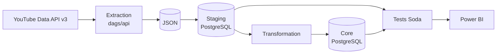
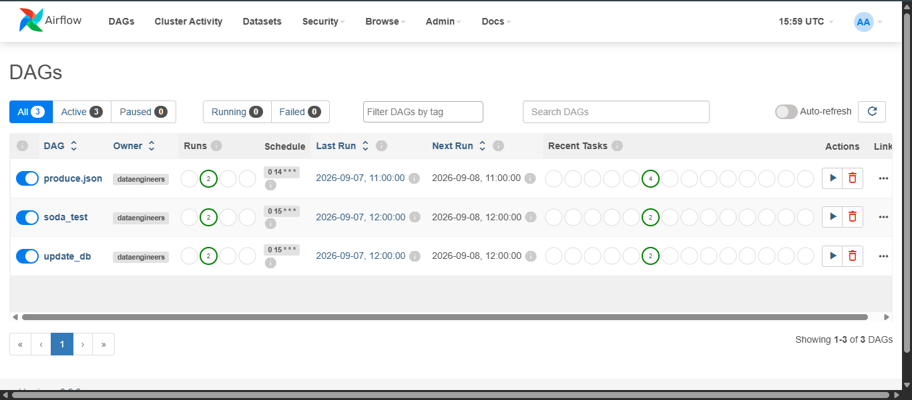
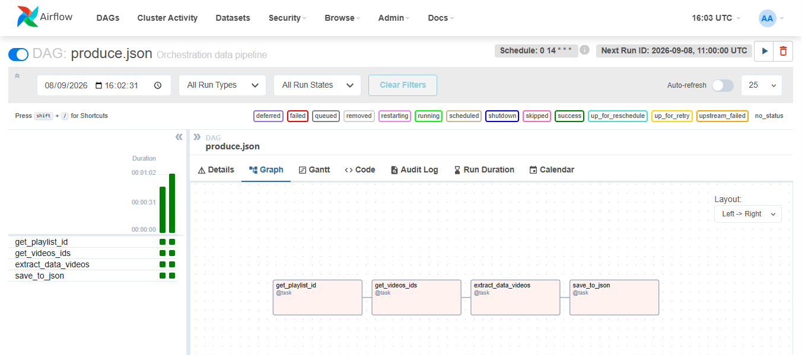
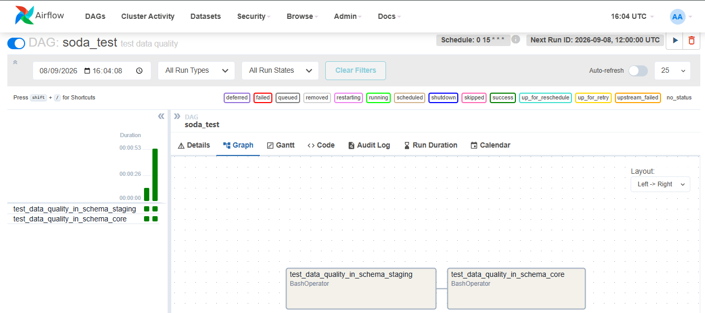
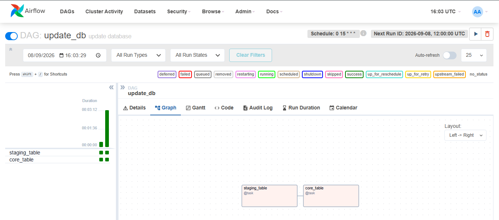
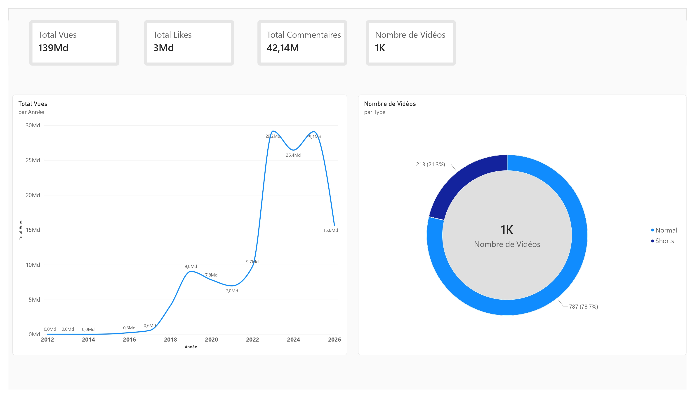
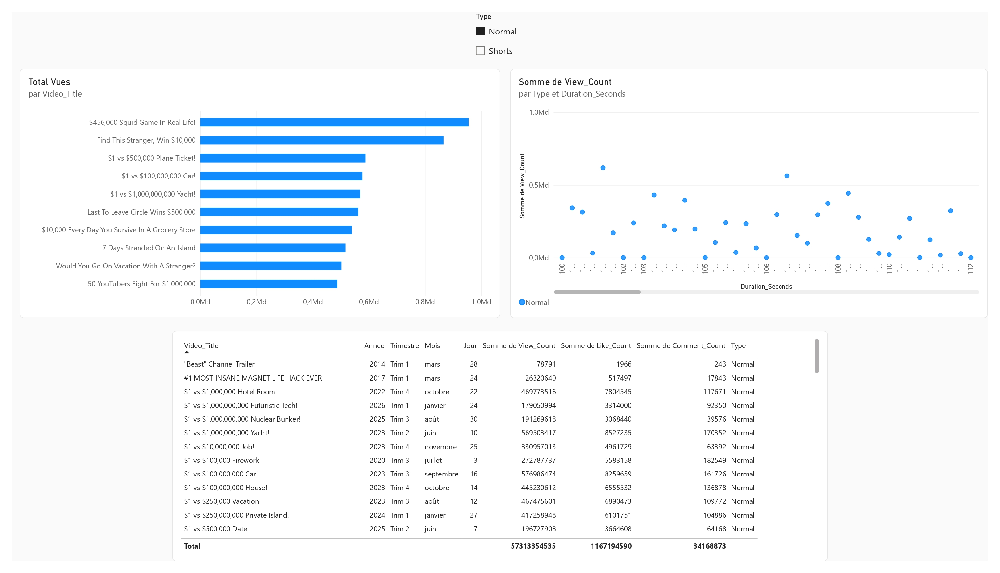
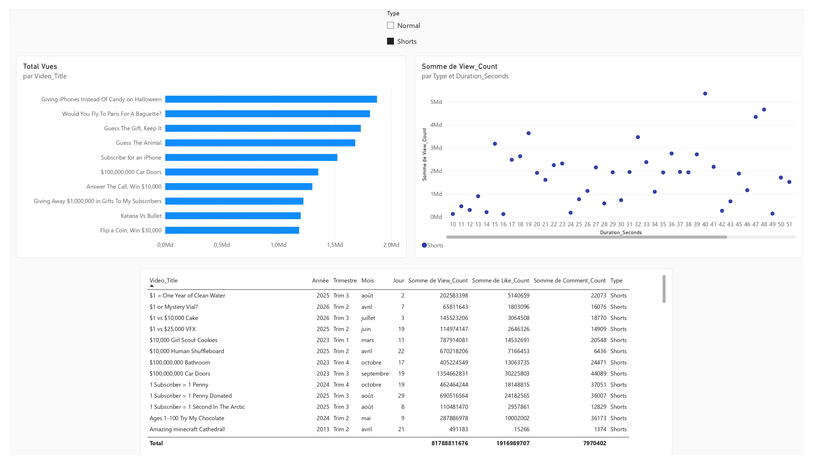

# 🎬 YouTube Data Pipeline — Mr Beast Channel Analytics


Pipeline ELT qui extrait les données de la chaîne YouTube Mr Beast via l'API YouTube Data v3,
les charge et transforme dans PostgreSQL, valide leur qualité avec Soda, et les visualise dans Power BI.


## 📁 Structure du projet

```
youtube_api_elt/
├── dags/
│   ├── main.py                    # Orchestration des DAGs
│   ├── api/
│   │   └── videos_api.py          # Extraction (YouTube Data API v3)
│   ├── data_warehouse/
│   │   ├── dwh.py                 # Tables staging/core
│   │   ├── data_load.py
│   │   ├── data_transformation.py
│   │   └── data_utils.py
│   └── data_quality/
│       └── soda.py                # Lancement des tests Soda
├── include/soda/
│   ├── checks.yml                 # Règles de qualité des données
│   └── configuration.yml
├── docker/postgres/
│   └── init-multiple-databases.sh # Init des bases (metadata, celery, elt)
├── tests/
│   ├── conftest.py
│   └── unit_test.py
├── .github/workflows/
│   └── CI_CD_YT_ELT.yaml          # Pipeline CI/CD
├── docker-compose.yaml
├── dockerfile
├── requirements.txt
└── .env.example
```

## ⚙️ Prérequis

- Docker & Docker Compose
- Une clé API YouTube Data API v3 ([obtenir une clé](https://console.cloud.google.com/apis/library/youtube.googleapis.com))

## 🚀 Installation

1. Cloner le repo
```bash
   git clone https://github.com/gaeledwin/youtube-api-elt.git
   cd youtube_data
```

2. Copier le fichier d'environnement et le remplir
```bash
   cp .env.example .env
```
   Renseigner notamment : `API_KEY` (ta clé YouTube), `CHANNEL_HANDLE`, les identifiants PostgreSQL, `FERNET_KEY` (générée avec `python -c "from cryptography.fernet import Fernet; print(Fernet.generate_key())"`)

3. Lancer les conteneurs
```bash
   docker-compose up -d
```

4. Accéder à l'interface Airflow
```
   http://localhost:8080
```

## ▶️ Exécution du pipeline

Le pipeline est orchestré par 3 DAGs Airflow :

| DAG | Rôle | Planification |
|---|---|---|
| `produce.json` | Extraction des données via l'API YouTube et sauvegarde en JSON | Quotidien, 14h |
| `update_db` | Chargement staging → transformation → core (PostgreSQL) | Quotidien, 15h |
| `soda_test` | Validation qualité des données (staging puis core) | Quotidien, 15h |

**Vue d'ensemble**



**Détail par DAG**







## ✅ Qualité des données (Soda)

Les données sont validées à deux niveaux (`staging` et `core`) via [Soda Core](https://www.soda.io/), avec les règles suivantes définies dans `include/soda/checks.yml` :

| Contrôle | Règle |
|---|---|
| Complétude | `Video_Id` ne doit jamais être manquant |
| Unicité | Aucun doublon sur `Video_Id` |
| Cohérence | Nombre de likes ≤ nombre de vues |
| Cohérence | Nombre de commentaires ≤ nombre de vues |

## 📊 Dashboard Power BI

Le dashboard Power BI se compose de deux pages :

**Vue d'ensemble** — KPIs globaux (vues, likes, commentaires, nombre de vidéos), évolution des vues par année, et répartition Normal vs Shorts.



**Détail par vidéo** — Top vidéos par nombre de vues, distribution des vues selon la durée, et table détaillée, filtrable par type de contenu (Normal / Shorts).


| Vidéos "Normal" | Vidéos "Shorts" |
|---|---|
|  |  |